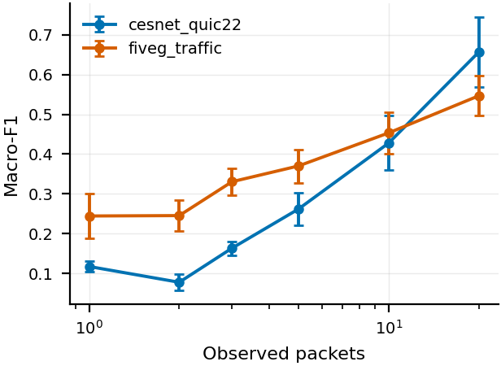
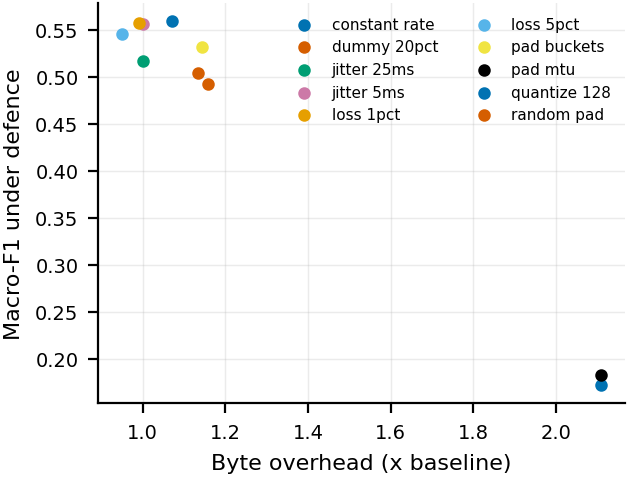
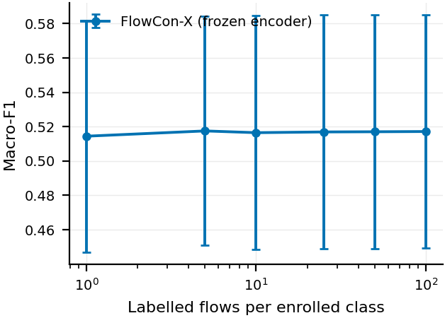
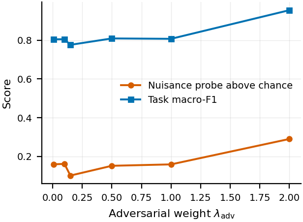

<div align="center">

# FlowCon-X

**Encrypted traffic classification under realistic evaluation protocols**

[](https://github.com/Mayan10/Flowconx/actions/workflows/ci.yml)
[](https://www.python.org/downloads/)
[](LICENSE)
[](https://github.com/astral-sh/ruff)
[](https://mypy-lang.org/)
[](tests/)
[](scripts/make_paper_assets.py)

A flow-level metric-trained embedding for application and service
classification from packet metadata alone — no deep packet inspection, no
payload bytes, no SNI at inference — together with the audit machinery needed
to tell whether such a result means anything.

[Where this stands](#where-this-stands) ·
[Results](#results) ·
[Quick start](#quick-start) ·
[Reproducing every asset](#reproducing-every-table-and-figure) ·
[Claims](#claims) ·
[Datasets](#datasets)

</div>

---

This repository is the artifact behind a paper in preparation. It is built so
that a reviewer can download it, run it, and try to break the claims — and so
that we could not avoid finding out when they broke.

## Where this stands

> **Six of the nine claims this project set out to make have failed, and the
> evidence that killed them is in this repository.** That is the honest summary,
> and it belongs here rather than in an appendix.

What survived is a **measurement** result, not a modelling one.

### What holds

- **The split axis that matters is corpus-specific.** On 5G Traffic the same
  model scores macro-F1 **0.992** under the split protocol the
  encrypted-traffic literature standardly uses, **0.567** under a
  session-disjoint one, and **0.433** under a temporal one — a 0.56 swing with
  nothing changed but the partition. On CESNET-QUIC22 that same contrast finds
  *nothing* (**0.781** random vs 0.780 session-disjoint), but server-disjoint
  splitting costs 0.19 (**0.588**). Controlling the wrong axis protects
  nothing, and the audit's identifier probes tell you which axis to control:
  server IP alone scores 0.999 on 5G under a random split; SNI alone scores
  **0.967** on CESNET.
- **Distance-based rejection of unknown applications beats softmax
  thresholding**, accepting roughly a third fewer unknowns at matched
  true-positive rate (FPR@95TPR **0.359** ± 0.116 vs **0.559** ± 0.107).
- **Only countermeasures costing 2.11× bandwidth degrade the classifier**
  meaningfully. Random padding, dummy injection and size quantisation cost the
  defender 7–16% overhead and the attacker essentially nothing.

### What failed

- **Closed-set accuracy.** FlowCon-X beats every deep baseline we ran and loses
  to gradient-boosted trees on both corpora — **0.780** vs 0.790 on CESNET,
  **0.567** vs 0.849 on 5G. On 5G *every* neural model lands in a 0.05 band
  while a tree on thirteen flow scalars sits 0.25 above; it is not this
  architecture, it is the approach.
- **Few-shot enrollment** *within* a corpus. The curve is flat: +0.003 macro-F1
  from one labelled example to a hundred, failing a rule written before the run.
  It turned out to be the wrong test — **across** corpora, where the prototypes
  are genuinely wrong, five labelled flows per class recover 0.68 of a 0.25
  zero-shot deficit. The claim was mis-specified, not false.
- **Temporal drift.** Accuracy *rises* over the held-out days. A four-week
  corpus cannot exhibit the phenomenon, so the claim is withdrawn rather than
  supported by a flat line.
- **Adversarial nuisance removal.** The embedding leaks capture identity at the
  same rate as its own raw input (+0.29 vs +0.28 above chance), and a sweep of
  the adversarial weight over two orders of magnitude does not change that at
  any point. It is the mechanism, not the tuning.
- **"Identifier shortcuts do not explain the task."** SNI alone scores 0.967 on
  CESNET — above every model in this repository, ours included.

### The open question

The model is an **application fingerprinter** being scored on a **service
taxonomy**. On identical data, split and budget it reaches 0.701 macro-F1
naming the application and 0.567 naming the service category; from a single
labelled flow, 0.757 against 0.502. Whether that reframing survives contact
with gradient-boosted trees is queued and unmeasured — four hypotheses of that
shape have already failed here.

---

## Results

Every figure below is regenerated by `make paper` from the JSON in `results/`.
The PNGs shown here and the PDFs the paper includes are written from the same
figure object in the same pass, so the image on this page cannot drift from the
one under review.

<table>
<tr>
<td width="50%" valign="top">

**Deciding from few packets**



Accuracy against packets observed. Useful accuracy arrives well before a flow
completes, which is what makes an inline deployment arguable at all — but the
curve is still climbing at 20 packets on both corpora.

</td>
<td width="50%" valign="top">

**Robustness against defence cost**



Each point is a countermeasure. Only the two that more than double bandwidth
(`pad_mtu`, `constant_rate`, both 2.11×) actually break the classifier. The
cheap defences buy the defender almost nothing.

</td>
</tr>
<tr>
<td width="50%" valign="top">

**Few-shot enrollment**



The negative result. Within a corpus the curve is flat from 1 to 100 labelled
examples — the prototypes were already in the right place, so there was nothing
for enrollment to fix. It recovers across corpora, where they are not.

</td>
<td width="50%" valign="top">

**Adversarial trade-off**



Nuisance leakage against the adversarial weight, swept over two orders of
magnitude. The leak never drops below the raw-feature control, so the
gradient-reversal head is not doing what it was added to do.

</td>
</tr>
</table>

---

## How this repository is built

Every result above came from trying to break the previous one. Four rules made
that possible, and they are enforced mechanically rather than by discipline:

1. **Every reported number sits next to a trivial baseline.** Destination port
   alone, SNI alone, server IP alone, capture-session ID alone. Two of those
   beat the model.
2. **The random flow split is a contrast column, never a headline.**
3. **Nothing is reported that a script did not produce.** Cells with no run
   behind them read `TODO`; `scripts/check_paper.py` fails the build on one,
   and `scripts/check_readme.py` checks the numbers in *this file* against the
   generated tables, because prose is where stale numbers hide.
4. **Every model number here is a lower bound.** 13 of 16 runs stopped with
   validation accuracy still rising — the epoch budget is a compute decision,
   not a modelling one. See [`paper/THREATS.md`](paper/THREATS.md) §8.

---

## Claims

| # | Claim | Evidence | Status |
| --- | --- | --- | --- |
| C1 | The split axis that matters is corpus-specific; controlling the wrong one protects nothing | [`paper/tables/split_contrast.tex`](paper/tables/split_contrast.tex) | **supported** (5G: capture axis; CESNET: server axis, −0.19 macro-F1) |
| C2 | Competitive under strict protocols — **not** state of the art | [`paper/tables/`](paper/tables/) | beats all deep baselines; loses to trees on both corpora (0.780 vs 0.790; 0.567 vs 0.849) |
| C3 | Identifier shortcuts do not explain the task | main comparison, shortcut tier | **not supported** — SNI alone scores 0.967 on CESNET, above every model |
| C4 | Metric-trained embedding rejects unknown applications better than softmax | [`paper/tables/open_set.tex`](paper/tables/open_set.tex) | **supported** on FPR@95TPR (0.359 vs 0.559); AUROC gap within seed spread |
| C5 | New applications enroll from a handful of flows, no retraining | [`docs/figures/enrollment_curve.png`](docs/figures/enrollment_curve.png) | **not supported within a corpus** — curve flat, failed its pre-registered rule; recovers across corpora |
| — | *Reframing:* the model is an application fingerprinter, not a service classifier | `results/flowconx_app_task/` | internal comparison holds (0.701 vs 0.567); baselines on the app task not yet run |
| C6 | Degrades gracefully over time; cheaply restored by re-enrollment | `drift` block | **withdrawn** — a 4-week corpus cannot exhibit drift |
| C7 | Survives padding defences at a stated overhead | [`docs/figures/robustness_overhead.png`](docs/figures/robustness_overhead.png) | **supported** (only 2.11×-overhead defences bite) |
| C8 | Decides from few packets, fast enough to sit inline | [`paper/tables/cost.tex`](paper/tables/cost.tex) | **partially supported** (p50 6.85 ms end-to-end) |
| C9 | Adversarial removal reduces nuisance leakage without destroying the representation | `probes` block | **not supported** — leak equals the raw-feature control |

Full statements, the test behind each, and the claims we explicitly do **not**
make are in [`paper/CLAIMS.md`](paper/CLAIMS.md). Limitations are in
[`paper/THREATS.md`](paper/THREATS.md), including the ethics statement.

> **We do not claim to beat ET-BERT.** We could not run it: it tokenises raw
> payload bytes, which QUIC/TLS does not expose and our records do not retain.
> [`flowconx/baselines/WHY_NOT_RUN.md`](flowconx/baselines/WHY_NOT_RUN.md)
> gives the reason for each of the six pre-trained models in that position.

---

## Quick start

```bash
git clone https://github.com/Mayan10/Flowconx.git && cd Flowconx
make setup                    # install the package and dev dependencies
make test                     # lint, types, 180 unit and leakage tests (no data)
make verify                   # full pipeline on generated data (~2 min, no data)

./scripts/download_data.sh    # licences, DOIs, checksums; ~24 GB
make data                     # build both datasets from the archives (~30 min)
make audit                    # shortcut and leakage audit (~15 min)
make repro-small              # reduced end-to-end pipeline (<30 min on one GPU)
```

`make test` and `make verify` both need **no data at all**. `make verify`
generates a table in the canonical schema and runs the entire pipeline over it
— audit, split manifests, training, every evaluation mode, seed aggregation,
significance testing and paper-asset generation — asserting each stage produced
what it claims. Run it before downloading 24 GB of archives; it is what
confirms the pipeline works. It checks plumbing, not science: the generated
data is separable by construction and its numbers mean nothing.

Docker, if you prefer:

```bash
docker build -t flowconx .    # the leakage suite runs during the build
docker run --rm -v "$PWD/data:/work/data" -v "$PWD/results:/work/results" \
  flowconx make repro-small
```

### Building the paper

```bash
make -C paper                 # regenerates every table and figure, then compiles
```

Either [tectonic](https://tectonic-typesetting.github.io/) (self-contained,
fetches the `acmart` class on first run) or a full TeX distribution with
`pdflatex` works; the Makefile prefers tectonic when both are present. Assets
are regenerated before every build, so the PDF can never be newer than the
numbers it reports.

### Hardware and time

| Step | Time | Hardware | Disk |
| --- | ---: | --- | ---: |
| `make test` | ~4 min | any | — |
| `make verify` | 2 min | any, CPU only | — |
| `make data` | ~30 min | 8 cores; no GPU | 24 GB raw (read-only), 420 MB output |
| `make audit` | ~15 min | 8 cores; no GPU | 5 MB |
| One training run | ~10 min | 1 GPU (or Apple MPS) | 2 MB |
| `make repro-small` | ~30 min | 1 GPU | 10 MB |
| `make repro-full` | ~20 h | 1 GPU | 200 MB |

> **The archives are never expanded.** They are 3.2 GB and 21 GB; every loader
> streams members out of the zip in place. 24 GB of free disk is enough to run
> everything.

---

## Reproducing every table and figure

Each row is self-contained: run the command, get the asset.

| Asset | Command |
| --- | --- |
| Table 1 — split protocol contrast | `make data && make audit && python scripts/run_all_experiments.py --stages headline split_contrast && make paper` |
| Table 2 — main comparison | `make audit && python -m flowconx.baselines.run_baselines --config configs/cesnet_main.yaml --seed 0 && make paper` |
| Table 3 — ablations | `python scripts/run_all_experiments.py --stages ablations --seeds 0 1 2 3 4 && python -m flowconx.analysis.significance && make paper` |
| Table 4 — deployment cost | `python -m flowconx.run --config configs/cesnet_main.yaml --seed 0 && make paper` |
| Table 5 — open-set rejection | `python scripts/run_all_experiments.py --stages novelty --seeds 0 1 2 && make paper` |
| Fig. 1 — early classification | `python -m flowconx.run --config configs/cesnet_main.yaml --seed 0 --set eval.early_classification=true` |
| Fig. 2 — enrollment curve | `python -m flowconx.run --config configs/fiveg_open_set.yaml --seed 0` |
| Fig. 3 — robustness vs overhead | `python -m flowconx.run --config configs/fiveg_main.yaml --seed 0 --set eval.robustness=true` |
| Fig. 4 — adversarial trade-off | `python scripts/run_all_experiments.py --stages ablations --seeds 0 1 2` (the `adv_weight_*` family) |
| Audit tables (`AUDIT.md` §8) | `make audit` |

Every command writes JSON into `results/`; `make paper` renders `results/` into
`paper/tables/*.tex`, `paper/figures/*.pdf` and `docs/figures/*.png`. **Tables
are never edited by hand**, and figure output is byte-reproducible — rerunning
`make paper` on unchanged results produces identical files.

---

## Repository layout

```
flowconx/
  data/          loaders (one module per source), canonical schema, zip streaming
  features/      deterministic feature extraction, unit tested
  models/        encoders, fusion, heads, memory and prototype banks
  losses/        contrastive, margin, adversarial — each independently toggleable
  train/         the training loop
  eval/          closed-set, open-set, few-shot, drift, robustness, early, cost, probes
  audit/         split protocols, trivial baselines, leakage probes
  baselines/     deep non-pretrained baselines, and WHY_NOT_RUN.md
  analysis/      significance testing and seed aggregation
  run.py         the single entry point
configs/         every experiment is a YAML file; ablations/ holds 35 of them
scripts/         download_data.sh, run_all_experiments.py, make_paper_assets.py, checkers
splits/          committed split manifests: flow-ID lists plus SHA256 per side
results/         metrics.json per run, committed (small JSON only)
docs/figures/    PNG renders of the paper figures, for this README
paper/           auto-generated tables and figures, plus CLAIMS/THREATS/VENUE/RESULTS
tests/           180 tests, including the leakage suite that gates CI
```

### One entry point

```bash
python -m flowconx.run --config configs/cesnet_main.yaml --seed 0
python -m flowconx.run --config configs/cesnet_main.yaml --seed 0 --set model.fusion=concat
python -m flowconx.run --config configs/cesnet_main.yaml --dry-run   # resolve and print
```

Nothing important is reachable only from a notebook. Every ablation is a config
override, so an ablation table row is a file rather than a code branch. A run
refuses to overwrite an existing `metrics.json` unless `--overwrite` is given,
so a sweep cannot silently replace a number a table already cites.

### Determinism

Each run seeds Python, NumPy, Torch and CUDA, requests deterministic
algorithms, and records into `metrics.json`: the seed, the config hash, the git
commit **and whether the tree was dirty**, library versions, the device, and
wall-clock time. `tests/test_determinism.py` asserts that the same config and
seed give identical metrics — and that different seeds do not, since otherwise
every error bar in the paper would be fictitious.

### Continuous integration

| Job | What it gates |
| --- | --- |
| `lint` | `ruff` over `flowconx`, `scripts`, `tests` |
| `typecheck` | `mypy` over the data, feature, config and metric layers |
| `tests` | 180 tests on Python 3.10 and 3.11, including the leakage suite |
| `audit-smoke` | paper source, README numbers, an end-to-end audit, and `make verify` |

The leakage tests are the real gate. A split that stops being a partition, a
feature family that starts exposing an identifier, or a split protocol that
silently degrades instead of raising, fails the build.

---

## Datasets

Both are public. Neither is redistributed here; `scripts/download_data.sh`
carries the licences, DOIs and checksums.

| | 5G Traffic | CESNET-QUIC22 |
| --- | --- | --- |
| Source | Kaggle, CC BY 4.0 | Zenodo `10.5281/zenodo.7409648`, CC BY 4.0 |
| Raw | 75 packet captures, 44 GB | 28 daily flow files, 4 weeks |
| Read | 330 M packet rows | 153 M flow rows |
| Flows kept | 164,348 | 201,600 |
| Classes | 6 service categories | 18 service categories |
| Applications | 15 | 104 |
| Timeline | May–Oct 2022 | 2022-10-31 → 2022-11-27 |
| Provenance | capture, server IP, port, timestamp | capture day, client/server IP, port, SNI, AS, timestamp |

> **They are kept separate and never concatenated.** An earlier version merged
> them, and the merge itself became the shortcut: `protocol == 0` was 99.9% one
> class, because that value recorded which preparer had run rather than
> anything about the traffic (`AUDIT.md` §3, L3).

A row is one **conversation segment**: packets between one client and one
server over one transport, bounded by an idle and an active timeout. The
provenance columns — addresses, ports, SNI, capture ID — are retained
deliberately, so the audit can measure how much each explains on its own, and
are excluded from `MODEL_INPUT_COLUMNS`. `tests/test_leakage.py` asserts the
exclusion mechanically rather than trusting it.

A third corpus, ISCX-Tor2016, has a loader
([`flowconx/data/iscx_tor.py`](flowconx/data/iscx_tor.py)) and a documented
protocol, but has **not been run** — the download sits behind a registration
form. Every assumption its loader makes is marked `[ASSUMED]` with instructions
for checking it against real data.

---

## What the audit checks

`make audit` runs, for every split protocol the data supports:

- **Identifier probes** — port only, SNI only, server IP and /24 prefix only,
  server AS only, capture ID only, transport protocol only.
- **Classical baselines** — 5 flow statistics (RF), packet-size histogram
  (XGBoost), CUMUL, AppScanner, k-fingerprinting, all on the identical splits.
- **Leakage probes** — split partition, per-identifier disjointness, exact and
  near-duplicate rows across splits, identifiers-as-inputs, and whether the
  declared nuisance variable is derivable from the model's own inputs.

A probe whose precondition is missing reports `unavailable` with the reason. It
never quietly passes, and it never reports a degenerate number as if it were a
finding: a dataset with no SNI column reports `n/a` for the SNI probe, not "SNI
does not help".

`AUDIT.md` is the full Phase 0 audit of the previous pipeline, including the
defects this version fixes.

---

## Citing the data

```bibtex
@article{luxemburk2023cesnet,
  title   = {{CESNET-QUIC22}: A large one-month {QUIC} network traffic dataset
             from backbone lines},
  author  = {Luxemburk, Jan and Hyn{\v{c}}ica, Karel and {\v{S}}ediv{\'y}, Jakub},
  journal = {Data in Brief},
  year    = {2023},
  doi     = {10.1016/j.dib.2023.108888}
}
```

The 5G Traffic Datasets are distributed on Kaggle under CC BY 4.0; see
`scripts/download_data.sh` for the attribution the licence requires.

---

## Authors

Mayan Sharma, Kriti Saini and Devansh Behl.

## Licence

MIT. See [`LICENSE`](LICENSE).
